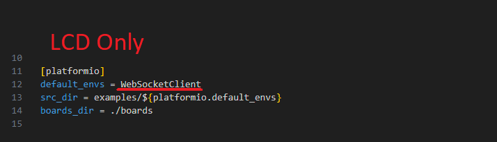

# T-Display-S3-Wifi-Image-Transfer
Transfer images to the T-Display S3 wirelessly, Cross compatible with both T-Display-S3 LCD and AMOLED.

# Setup VSCode
Windows - Visual Studio Code - Python

Clone Repo
 - T-Display-S3 LCD: https://github.com/Xinyuan-LilyGO/T-Display-S3
 - OR
 - T-Display-S3 AMOLED: https://github.com/Xinyuan-LilyGO/T-Display-S3-AMOLED

Open in VSCode
 - Open the repo in Visual Studio Code
 - > Click on the extensions tab in the left column → search platformIO → install the first plug-in
 - > Click Platforms → Embedded → Search Espressif 32 in the input box → Select the corresponding firmware installation

Add WebSockets Library
 - In VSCode, Open the PIO Home (The home button bottom left of VSCode window)
 - Go to the Libraries tab
 - Search "WebSockets"
 - The correct library to add is "WebSockets by Markus Sattler". Tested with version 2.4.1, Latest version should work.

Add Code
 - Return to the Exporer tab in VSCode in the left column
 - Expand the "examples" folder
 - Create a new folder, name it something like "WebSocketClient"
 - Create a new file in that folder, name it something like "WebSocketClient.cpp"
 - Expand the "lvgl_demo" folder (AMOLED) or expand the "lv_demos" folder (LCD)
 - (AMOLED ONLY) Copy pins_config.h rm67162.cpp and rm67162.h into to the new folder you created
 - (LCD ONLY) Copy pin_config.h into the new folder you created
 - Open the new .cpp file you created, it should be empty
 - Copy the code from "WebSocketClient.cpp" located in this repo into the file you created.

Modify Code for your Platform
 - open the .cpp file you created and copied code into
 - (AMOLED ONLY) the first line of the file should be #define PLATFORM_LCDA
 - (LCD ONLY) the first line of the file should be #define PLATFORM_LCD

Modify platformio.ini
 - In the Explorer tab in VSCode open the platformio.ini file
 - (AMOLED ONLY) change src_dir to use the name of the folder you created earlier
   
 - (LCD ONLY) change default_envs to use the name of the folder you created earlier
   

You can now build and upload the project to your T-Display-S3
 - be sure to change the ip address in the cpp file to the ip address of your local computer you will be runing the python server on!
 - Be sure to change the wifi SSID and Password in the cpp file

# Setup Python
Install Python 3.11 or greater from https://www.python.org/downloads

Install Dependencies
 - open a cmd window and run the following:
 - > pip install websockets websocket-client requests pillow

Run server and client
 - Run the server.py file and note the ip address it shows
 - Open the client.py file in a text editor and change the local_ip variable to the one displayed in the server.py console
 - Run the client.py file, in the server.py console you should see a new connection as "MAIN"
 - Type into the client.py console "list sessions" to list all connections to the server

# Setup Complete

Basic Usage
 - On the T-Display press the top button to open the menu, use the other button to cycle between options
 - In the client.py console type "url <link-to-img>" or "image <filename-without-extension>" (be sure the file is in same directory)
 - On the T-Display, in the Menu, under Files, you can save and load images to the Flash memory, Use "Write Flash" to save the currently displayed image to flash memory
 - You can store up to 255 images on the flash memory, maybe more if you modify the code.

# Faster Image Uploading (OPTIONAL)

Modify WebSockets Library
 - In VSCode Explorer expand the ".pio" folder → expand "libdeps" → expand "T-Display" → expand WebSockets → Open WebSockets.h
 - Change WEBSOCKETS_MAX_DATA_SIZE (15 * 1024) → WEBSOCKETS_MAX_DATA_SIZE (64 * 1024) under ESP32
 - Open server.py in a text editor
 - Change max_frame_size = 1024*15 → max_frame_size = 1024*64
